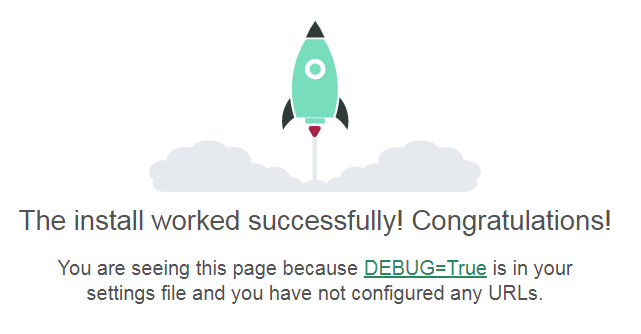

# Testing

## Manual Testing

| No. | Feature        | Steps        | Expected Outcome  | Actual Outcome |
| ------------- | ------------- | -------------    | ------------- | ------------- |
|  T01 | Install Django  | Install Django, psycopg2. Create requirements.txt. Name the Project **manxairlines**. Create the App and name it **booking**. Deployed locally.  | Expected to see the webpage showing the following message: *The install worked successfully!*  | PASS |

Screenshot

| No. | Feature        | Steps        | Expected Outcome  | Actual Outcome |
| ------------- | ------------- | -------------    | ------------- | ------------- |
|  T02 | Heroku Deployment  | Create App on Heroku. Call it **manx-airlines-bookings**. Setup a Database Instance on [elephantsql](elephantsql.com). Set up the following Heroku Config Vars:  1) Copy the generated URL into **DATABASE_URL**;  2) Copy Secret Key into **SECRET_KEY**;  3) Set **PORT to 8000**;  4) Set **DISABLE_COLLECTSTATIC to 1**.  Connect Heroku App to GitHub. Deploy.  | Expected to see the webpage showing the following message: *The install worked successfully!* As in the above screenshot | PASS |

Screenshot

## Automated Testing
